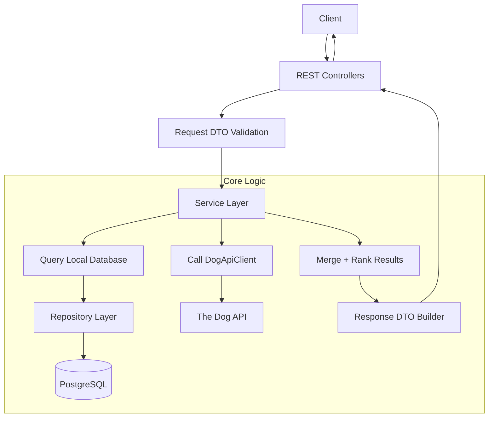
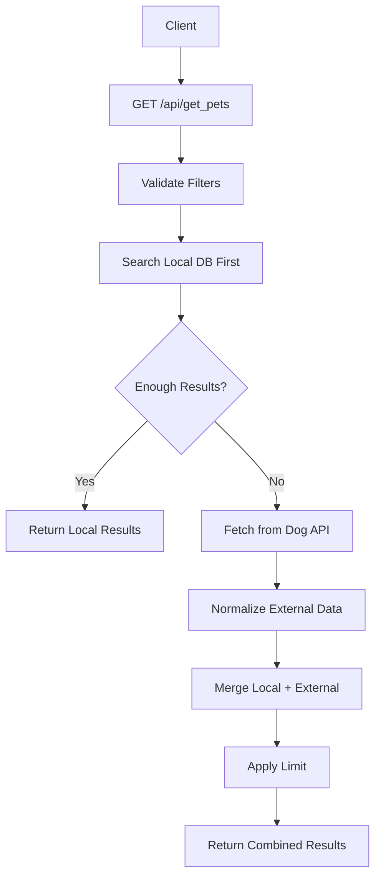
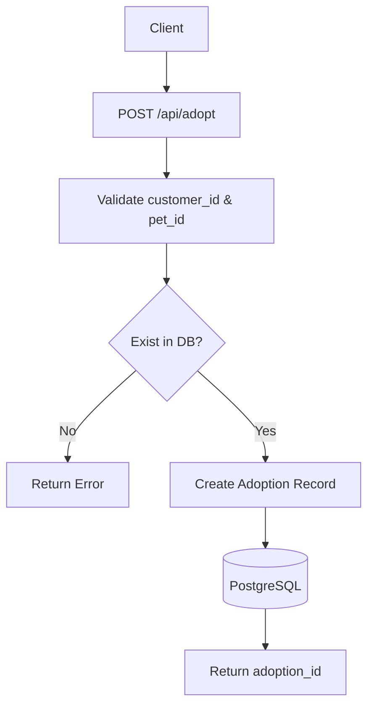
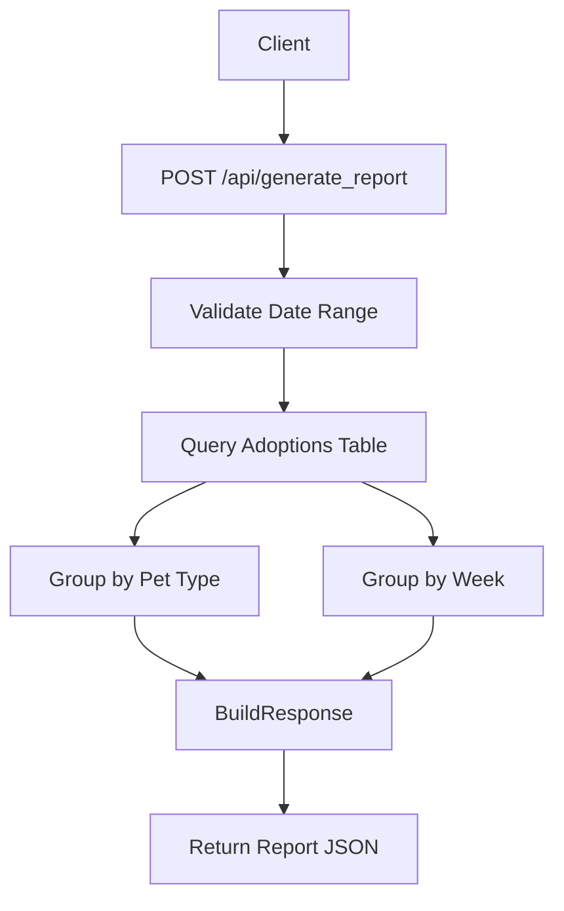
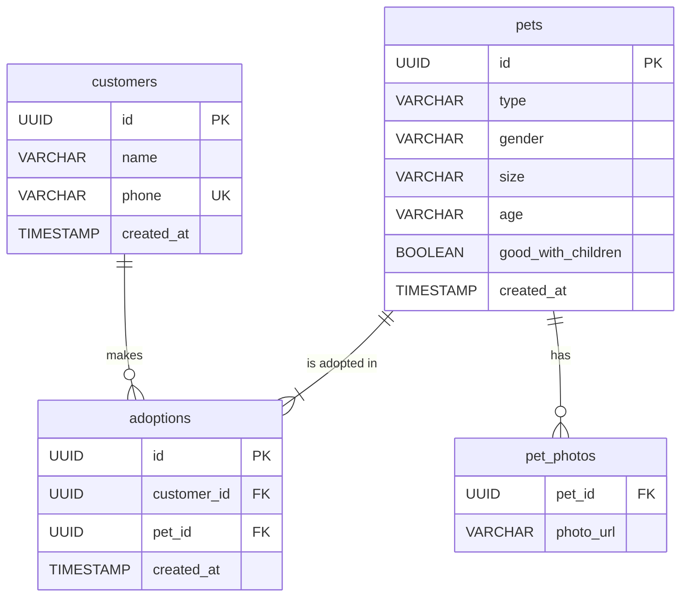

# 🐾 Buchi – Pet Finder App

Buchi is a Spring Boot application that helps users discover and adopt pets (dogs, cats, birds, etc.) that currently have no owners.


## Features

* Search for available pets with filters
* Adopt pets through a simple API
* Combine **local database results** with external API data
* Upload and store pet images
* Generate adoption reports


## Tech Stack

* Java + Spring Boot
* PostgreSQL
* Docker & Docker Compose
* Maven


## Architecture (Core API Logic)

This project follows a **layered architecture** where controllers handle HTTP requests, services contain business logic, and repositories manage database access.

### High-Level Request Flow




## Core Endpoint Flow (`GET /api/get_pets`)

This is the **main business logic** of the application:




## Adoption Flow




## Report Generation Flow




## External Pet Search

Buchi first searches pets stored locally.
If the requested result limit isn’t met, it fetches additional dogs from **The Dog API** and merges the results.

## Database Design (ER Diagram)

The application uses a relational data model centered around customers, pets, and adoptions.




### Design Notes

* A **customer** can adopt multiple pets over time
* Each **adoption** links a customer to a pet
* A **pet** can have multiple photos
* `good_with_children` enables filtering in search queries
* External API data is **not persisted**, only merged at runtime


### Configuration

```bash
DOG_API_KEY=your_api_key
DOG_API_BASE_URL=https://api.thedogapi.com/v1   # optional
PHOTO_UPLOAD_DIR=uploads/

DB_HOST=postgres
DB_PORT=5432
DB_NAME=petfinder
DB_USERNAME=postgres
DB_PASSWORD=postgres
```


## Running the App

### 1. Build and start services

```bash
docker-compose up --build
```

### 2. Run in background (detached)

```bash
docker-compose up -d
```

### 3. Stop services

```bash
docker-compose down
```


## API Overview

### Search Pets

```http
GET /api/get_pets
```

Example:

```bash
/api/get_pets?type=Dog&type=Cat&age=baby&age=young&limit=5
```


### Create Pet

```http
POST /api/pets
```


### Create Customer

```http
POST /api/customers
```


### Adopt Pet

```http
POST /api/adopt
```


### Generate Report

```http
POST /api/generate_report
```

```json
{
  "from_date": "2024-01-01",
  "to_date": "2024-12-31"
}
```


## Project Structure

* `controller/` → REST endpoints
* `service/` → business logic
* `repository/` → database access
* `entity/` → JPA models
* `dto/` → request/response objects
* `config/` → configuration


## Running Tests

```bash
./mvnw test
```
